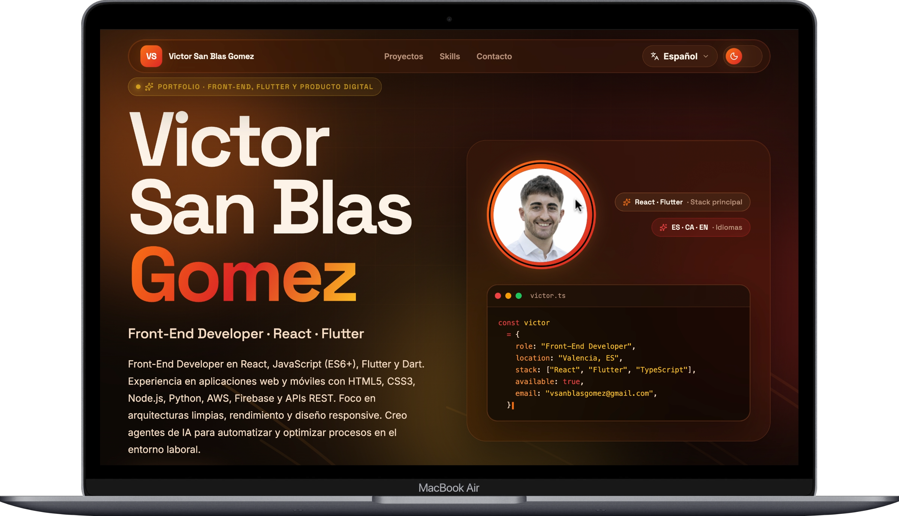

# Victor San Blas Gomez · Portfolio

Single-page React portfolio, designed as a working demo of the craft it claims to ship.
Trilingual (ES / EN / CA), accessible (WCAG 2.1 AA), deployed to GitHub Pages with CI/CD
on every push to `main`.

🔥 [Live](https://vsanblasgomez.github.io/vsanblasgomez-Portfolio/) · ♿ [WCAG 2.1 AA](https://www.w3.org/WAI/WCAG21/quickref/) · [MIT](#license)

**▶ [Visit the live site](https://vsanblasgomez.github.io/vsanblasgomez-Portfolio/)**



---

## What's inside

A warm, opinionated design system in code form. Hero with an animated SVG paths
background and a code-window motif, 5 editorial sections (01 – 05), 3-language
Context-based i18n, real contact form via Web3Forms with rate limit, real PDF CV
download, light/dark themes.

**Stack** — React 19 · TypeScript (strict) · Vite 8 · framer-motion 12 · lucide-react

No CSS framework, no UI kit, no Lorem Ipsum. Every pixel and every string is committed
to the repo.

## How it was built

Built with [OpenCode](https://opencode.ai) and a library of design skills — `shape`
for the multi-round brief discovery, `craft` for end-to-end build flow, `audit` for
the technical quality scan, and `polish` + `harden` for the final pass. Design
decisions, copy, and final QA were mine; the agent accelerated the iteration loop.

The working agreement that constrains the agent lives in [`AGENTS.md`](./AGENTS.md)
— useful to read before opening a PR.

## Run it locally

```bash
npm install
echo "VITE_WEB3FORMS_KEY=your_key" > .env
npm run dev
```

Push to `main` and `.github/workflows/deploy.yml` ships it to GitHub Pages.

## Get in touch

✉️ [vsanblasgomez@gmail.com](mailto:vsanblasgomez@gmail.com) · [GitHub](https://github.com/vsanblasgomez) · [LinkedIn](https://www.linkedin.com/in/vsanbla/) · [📄 CV](https://vsanblasgomez.github.io/vsanblasgomez-Portfolio/CV_Victor_SanBlas.pdf)
